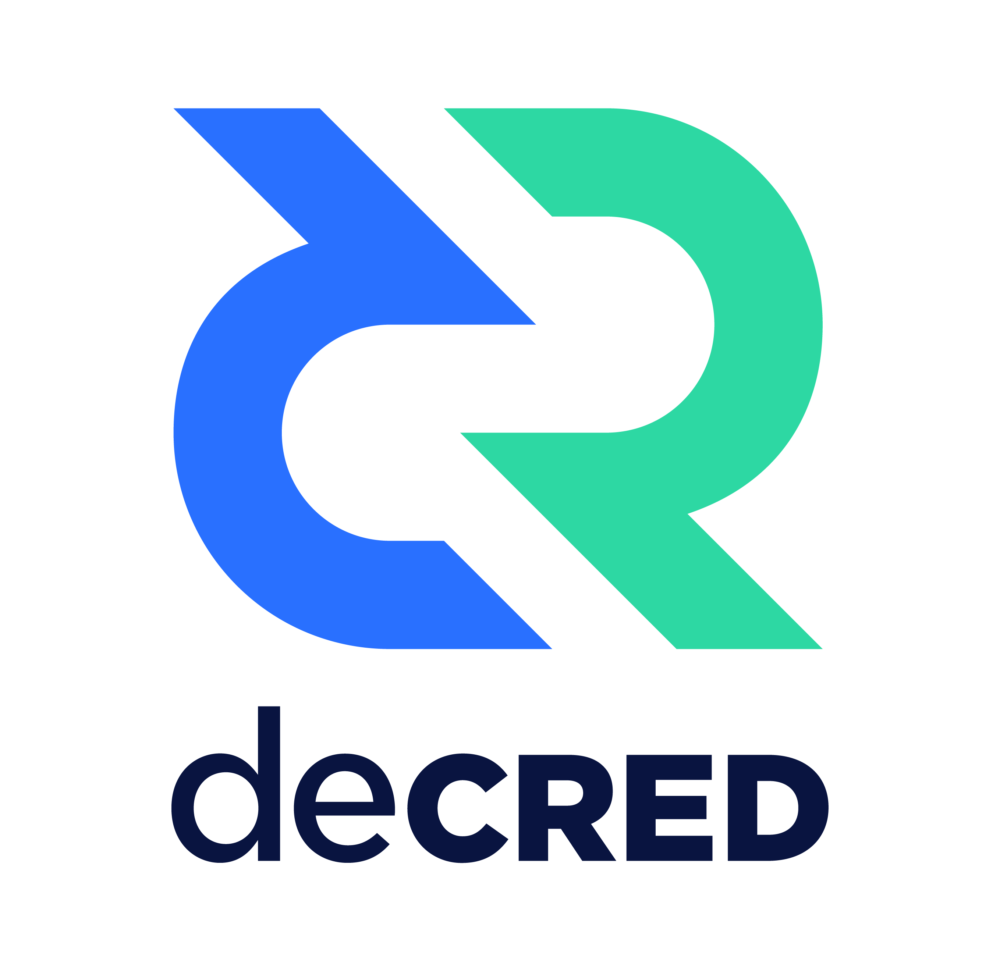

# Decred 中文社区(beta)
## Decred (/ˈdi:ˈkred/, /dɪˈkred/, dee-cred) 

Decred（DCR）是拥有社区自治的数字货币。通过混合共识系统，利益相关者可以制定规则，将其构建为去中心化、可持续和自治的货币。Decred将持续发展。我们的开发活动和质量都在业内名列前茅。Decred软件的特点包括：

* 创新的混合共识投票系统：工作量证明 (PoW) & 权益证明 (PoS)
* 基于区块链的抗审查公共提案系统Politeia
* 闪电网络
* 增强的用户隐私
* 基于原子交换的去中心化交易所（DEX）
* 更安全的简单支付验证（SPV）

#### 链上治理-链上共识投票
Decred 使用创新的混合共识机制：工作量证明 (PoW) 和权益证明 (PoS) ，为利益相关者提供激活新的共识规则的决策制定权。可实现从一组规则无缝过渡到另一组规则，同时保持现有区块链生态的完整性。

#### 链下治理-Politeia提案系统
Decred 使用抗审查的基于区块链的公共提案系统，授权用户从 DCR 的区块补贴中提交自我筹资的项目。Politeia (Pi) 确保了生态系统的可持续性和更好的发展。

#### 闪电网络
Decred 闪电网络 (DCRLN)允许 DCR 进行即时的微支付。使用闪电网络，Decred 可直接与现有的法定支付系统竞争。未来通过闪电网络实现分票功能将极大降低治理门槛。

#### 增强的用户隐私
Decred 隐私功能的目标是简单、适应性强及具有创造性。它基于由 Ruffing、Moreno-Sanchez 和 Kate 提出的“P2P 混合和不可链接比特币交易”中的 CoinShuffle++协议，将 mixnet 与我们的 PoS 治理系统集成在一起。

#### 基于原子交换的去中心化交易所（DEX）
DCRDEX是一种去中心化，非托管，不信任和无中介的加密货币交换平台，它提供的主要服务是在无需信任中心化实体的情况下，通过使用跨链原子交易的方式实现币币交易的过程。

#### 更安全的简单支付验证（SPV）
与Bitcoin的SPV作用相同，Decred也支持SPV，但是不同于Bitcoin的实现，Decred使用的客户端紧凑过滤器由闪电实验室(lightning labs)提案并提交给了bitcoin core， 该提案在BIP157， BIP158里被详细阐述。客户端从全节点(full node)下载各种过滤器， 然后在本地比较哪些区块包含自己期望的交易。在此过程中客户端不向服务器端提交任何隐私数据。客户端不需要信任服务器端。因为客户端不向服务端发送任何隐私数据， 因此窃听者或者恶意的服务器端不知道客户端在查询哪些交易。

